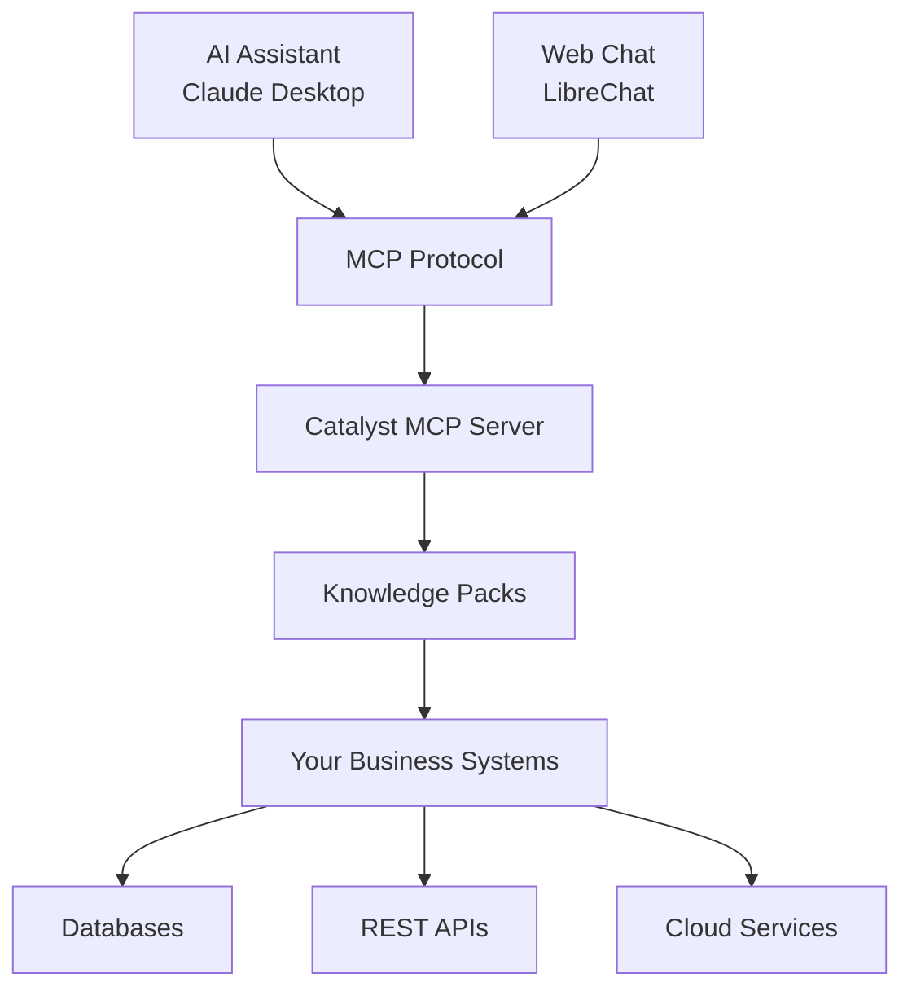

# Catalyst MCP Server

MCP (Model Context Protocol) server implementation that loads and serves Knowledge Packs.

[](https://hub.docker.com)
[](https://modelcontextprotocol.io)
[](https://pypi.org/project/catalyst-builder/)
[](https://opensource.org/licenses/MIT)
[](https://github.com/billebel/catalyst_mcp)

## Features

- MCP server implementation with FastAPI
- LibreChat integration for web interface  
- Docker deployment support
- Knowledge Pack loading from YAML configurations
- Authentication and rate limiting
- Support for multiple AI models (Claude, GPT, Gemini)

## Quick Start

### 1. Clone and Configure

```bash
# Clone the repository
git clone https://github.com/billebel/catalyst_mcp.git
cd catalyst_mcp

# Copy environment template
cp .env.example .env

# Edit .env with your API keys
nano .env
```

### 2. Set Your API Keys

Edit `.env` file:
```bash
# Add your API keys
ANTHROPIC_API_KEY=your-claude-api-key
OPENAI_API_KEY=your-openai-api-key        # Optional
GOOGLE_API_KEY=your-gemini-api-key        # Optional

# JWT secrets (change for production!)
JWT_SECRET=your-secure-jwt-secret
JWT_REFRESH_SECRET=your-secure-refresh-secret
```

### 3. Start with Docker

```bash
# Start the complete stack
docker-compose up -d

# View logs
docker-compose logs -f
```

### 4. Access Your AI Assistant

- **Web Chat Interface**: http://localhost:3080
- **MCP Server**: http://localhost:8443
- **API Documentation**: http://localhost:8443/docs

## Architecture



## Knowledge Packs

Catalyst includes example Knowledge Packs for common business systems:

| Pack | Description | Use Cases |
|------|-------------|-----------|
| **PostgreSQL Analytics** | Database queries and reporting | Business intelligence, data analysis |
| **GitHub DevOps** | Repository management and CI/CD | Code management, deployment tracking |
| **GitLab DevOps** | GitLab API integration | Project management, pipeline monitoring |
| **Linux Server Admin** | Server management and monitoring | System administration, log analysis |
| **RabbitMQ Messaging** | Message queue management | Queue monitoring, message handling |
| **S3 Storage** | AWS S3 file operations | File management, backup operations |

### Creating Custom Packs

Create Knowledge Packs using the **[Catalyst Builder](https://github.com/billebel/catalyst_builder)**:

```bash
# Install the pack builder
pip install catalyst-builder

# Create a new CRM integration pack
catalyst-packs create crm-integration \
  --type rest \
  --description "Connect to our CRM system"

# This generates a complete pack structure:
# crm-integration/
# ├── pack.yaml           # Main configuration
# ├── tools/              # Tool definitions
# ├── prompts/            # AI prompts
# └── README.md           # Documentation
```

The generated `pack.yaml`:
```yaml
metadata:
  name: crm-integration
  description: "Connect to our CRM system"
  domain: sales

connection:
  type: rest
  base_url: "https://api.yourcrm.com/v1"
  auth:
    method: bearer
    token: "${CRM_API_TOKEN}"

tools:
  - name: search_customers
    type: search
    description: "Find customers by name or email"
    endpoint: "/customers/search"
```

**Pack Builder Resources**:
- **[Catalyst Builder GitHub](https://github.com/billebel/catalyst_builder)** - Complete documentation
- **[Getting Started Guide](https://github.com/billebel/catalyst_builder/blob/main/docs/GETTING_STARTED.md)** - Step-by-step tutorial  
- **[CLI Reference](https://github.com/billebel/catalyst_builder/blob/main/docs/CLI_REFERENCE.md)** - All available commands
- **[Pack Development Guide](https://github.com/billebel/catalyst_builder/blob/main/docs/PACK_DEVELOPMENT.md)** - Advanced configuration

## Deployment Options

### Docker Compose (Recommended)

```bash
# Production deployment
docker-compose up -d

# Development with hot reload
docker-compose -f docker-compose.yml -f docker-compose.override.yml up -d
```

### Local Development

```bash
# Install Python dependencies
pip install -r requirements.txt

# Start MCP server
python -m catalyst_mcp.server

# Start chat interface (separate terminal)
# See docs/chat-customization.md for LibreChat setup
```

## Configuration

### Environment Variables

| Variable | Description | Required | Default |
|----------|-------------|----------|---------|
| `MCP_PORT` | MCP server port | No | `8443` |
| `MCP_HOST` | Server bind address | No | `0.0.0.0` |
| `LOG_LEVEL` | Logging level | No | `INFO` |
| `ANTHROPIC_API_KEY` | Claude API key | Yes* | - |
| `OPENAI_API_KEY` | OpenAI API key | No | - |
| `GOOGLE_API_KEY` | Gemini API key | No | - |
| `JWT_SECRET` | Chat authentication | Yes | - |
| `ALLOW_REGISTRATION` | Allow new users | No | `false` |

*At least one AI provider API key is required.

### Chat Interface Customization

Catalyst uses LibreChat for the web interface. Customize:

- **Branding**: Edit `librechat.yaml` for colors, logos
- **Authentication**: Configure OAuth providers in `.env`  
- **Models**: Enable/disable AI models per user
- **Plugins**: Add custom plugins and tools

See: [Chat Customization Guide](docs/chat-customization.md)

## AI Assistant Integration

### Claude Desktop

Add to your Claude Desktop configuration:

```json
{
  "mcpServers": {
    "catalyst": {
      "command": "mcp-client",
      "args": ["--url", "http://localhost:8443"]
    }
  }
}
```

### ChatGPT/OpenAI

Use the MCP-compatible plugin or direct API integration.

### Custom AI Applications

Connect any MCP-compatible AI application:

```python
import mcp_client

# Connect to Catalyst MCP server
client = mcp_client.MCPClient("http://localhost:8443")

# Use business tools
result = client.call_tool("search_customers", {"query": "ACME Corp"})
```

## Security Features

### Authentication & Authorization
- JWT-based session management
- Role-based access control
- OAuth provider integration (GitHub, Google, etc.)

### API Security
- Rate limiting and request throttling
- Input validation and sanitization
- Audit logging for compliance

### Deployment Security
- HTTPS/TLS encryption
- Environment variable secrets
- Container isolation

## Examples & Use Cases

### Business Intelligence
Use the **[Catalyst Builder](https://pypi.org/project/catalyst-builder/)** to create database analytics packs:

```bash
catalyst-packs create bi-dashboard --type database --description "Executive dashboard"
```

### DevOps Automation
Create deployment and monitoring packs:

```bash
catalyst-packs create devops-tools --type rest --description "CI/CD automation"
```

### Customer Support
Build support system integrations:

```bash
catalyst-packs create support-tools --type rest --description "Help desk integration"
```

## Community & Support

- **Catalyst Builder**: [catalyst-builder on PyPI](https://pypi.org/project/catalyst-builder/)
- **Documentation**: [Complete Pack Development Guide](https://github.com/billebel/catalyst_builder)
- **GitHub Issues**: [Report bugs and request features](https://github.com/billebel/catalyst_mcp/issues)

## License

MIT License

---

## Quick Commands

```bash
# Start everything
docker-compose up -d

# View logs
docker-compose logs -f catalyst-mcp

# Stop services
docker-compose down

# Create custom packs
pip install catalyst-builder
catalyst-packs create my-integration --type rest
```

## Getting Started

1. Clone repository: `git clone https://github.com/billebel/catalyst_mcp.git`
2. Install pack builder: `pip install catalyst-builder`
3. Create packs as needed
4. Deploy with Docker: `docker-compose up -d`