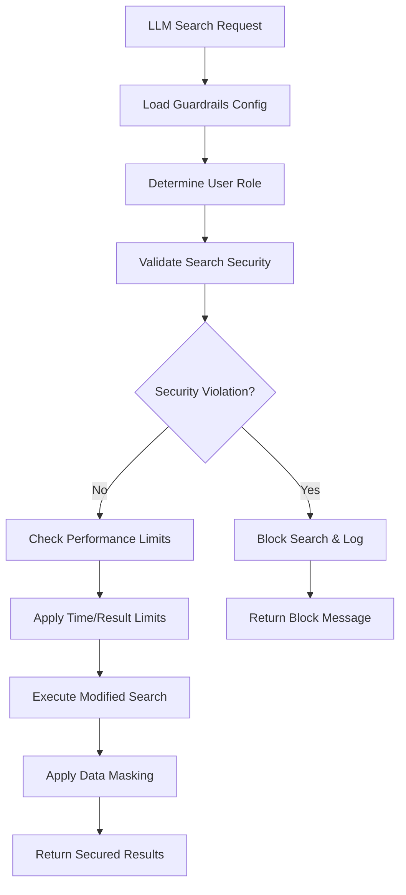

# Splunk Enterprise v2 Guardrails System

Comprehensive security, performance, and privacy controls for safe LLM tool calling with Splunk.

## Overview

The guardrails system provides multi-layered protection against dangerous operations, performance issues, and data privacy violations when LLMs interact with Splunk through the Enterprise v2 pack.

### 🛡️ Protection Layers

1. **Security Controls** - Prevent dangerous operations and malicious queries
2. **Performance Limits** - Protect against resource exhaustion and expensive searches  
3. **Privacy Controls** - Mask sensitive data and protect PII
4. **Role-Based Access** - Enforce user-appropriate restrictions
5. **Audit Logging** - Track all security events and policy violations

## Configuration

### Primary Configuration File

`guardrails.yaml` - Centralized configuration for all security policies

```yaml
guardrails:
  enabled: true                    # Master enable/disable
  fail_safe_mode: true            # Use strict defaults if config invalid
  audit_logging: true             # Log all security events

security:
  blocked_commands: [...]          # Commands that will prevent execution
  blocked_patterns: [...]          # Regex patterns that block searches
  warning_patterns: [...]          # Patterns that generate warnings

performance:
  time_limits: {max_time_range_days: 30}
  result_limits: {max_results_per_search: 1000}
  execution_limits: {search_timeout_seconds: 300}

privacy:
  data_masking: {enabled: true}
  sensitive_fields: [password, token, ssn, ...]
  masking_patterns: {email: "****@****.***", ...}

user_roles:
  admin: {max_time_range_days: 90, ...}
  power_user: {max_time_range_days: 60, ...}
  standard_user: {max_time_range_days: 7, ...}
```

## Security Controls

### Blocked Commands

Commands that are **completely prohibited** and will prevent search execution:

```yaml
blocked_commands:
  - "|delete"           # Data deletion
  - "|outputlookup"     # File system writes
  - "|sendemail"        # External communication
  - "|script"           # Script execution
  - "|external"         # External command execution
  - "|savedsearch"      # Saved search manipulation
```

### Blocked Patterns (Regex)

Dangerous search patterns that will block execution:

```yaml
blocked_patterns:
  - "index\\s*=\\s*\\*"          # Wildcard index searches
  - "search\\s+\\*"              # Unbound wildcard searches
  - "earliest\\s*=\\s*0"         # All-time searches
  - "eval.*system\\s*\\("        # System command injection
```

### Warning Patterns

Performance-impacting patterns that generate warnings but allow execution:

```yaml
warning_patterns:
  - "\\|\\s*transaction"         # Expensive transaction commands
  - "\\|\\s*join"                # Join operations (performance impact)
  - "rex\\s+field=_raw"          # Raw field regex (expensive)
```

## Performance Controls

### Time Range Limitations

```yaml
time_limits:
  max_time_range_days: 30          # Maximum search time span
  default_time_range: "-1h"        # Applied if no time specified
  max_earliest_time: "-365d"       # Cannot search beyond 1 year
```

**Enforcement Examples:**
- `earliest=-60d` → Limited to `-30d` for standard users
- No time range → Automatically adds `earliest=-1h`
- `earliest=0` → **BLOCKED** (all-time search)

### Result Limitations

```yaml
result_limits:
  max_results_per_search: 1000     # Hard limit per search
  default_result_limit: 100        # Applied if no limit specified
  max_events_to_process: 10000     # Internal processing limit
```

**Enforcement Examples:**
- No `| head` command → Automatically adds `| head 1000`
- `| head 5000` → Limited to `| head 1000` for standard users

### Execution Constraints

```yaml
execution_limits:
  search_timeout_seconds: 300      # 5 minute maximum execution
  max_concurrent_searches: 5       # Per-user concurrent limit
  rate_limit_searches_per_minute: 10  # Prevent search spam
```

## Privacy Controls

### Data Masking

Automatically masks sensitive information in search results based on field names and patterns.

#### Sensitive Field Detection

```yaml
sensitive_fields:
  # Authentication
  - "password", "passwd", "secret", "token", "api_key"
  
  # Personal identifiers  
  - "ssn", "social_security", "national_id"
  
  # Financial
  - "credit_card", "account_number", "routing_number"
  
  # Contact information
  - "email", "phone", "address", "postal_code"
```

#### Masking Patterns

```yaml
masking_patterns:
  email: "****@****.***"
  phone: "***-***-****"
  ssn: "***-**-****"
  credit_card: "****-****-****-****"
  ip_address: "xxx.xxx.xxx.xxx"
  default: "[MASKED]"
```

#### Field Filtering

Some fields are completely removed from results:

```yaml
filtered_fields:
  - "_raw"              # Raw event data (may contain sensitive info)
  - "punct"             # Punctuation patterns (can reveal structure)
```

### Example Data Masking

**Original Event:**
```json
{
  "username": "john.doe@company.com",
  "password": "secretpassword123", 
  "ssn": "123-45-6789",
  "host": "web-server-01"
}
```

**Masked Event:**
```json
{
  "username": "****@****.***",
  "password": "[MASKED]",
  "ssn": "***-**-****", 
  "host": "web-server-01"
}
```

## Role-Based Access Control

### User Role Hierarchy

1. **`admin`** - Highest privileges, minimal restrictions
2. **`power_user`** - Elevated access with moderate limits
3. **`standard_user`** - Standard restrictions for regular users
4. **`readonly_user`** - Most restrictive, read-only access

### Role-Specific Limits

| Setting | Admin | Power User | Standard User | Read-Only |
|---------|-------|------------|---------------|-----------|
| Max Time Range | 90 days | 60 days | 7 days | 1 day |
| Max Results | 10,000 | 5,000 | 1,000 | 100 |
| Concurrent Searches | 10 | 7 | 3 | 2 |
| Search Timeout | 10 min | 7.5 min | 5 min | 2 min |
| Data Masking | Optional | Enabled | Enabled | Enabled |

### Example Role Configuration

```yaml
standard_user:
  bypass_time_limits: false
  bypass_command_blocks: false        # Security blocks apply to all
  max_time_range_days: 7             # One week maximum
  max_results_per_search: 1000
  max_concurrent_searches: 3
  search_timeout_seconds: 300        # 5 minutes
  rate_limit_searches_per_minute: 10
  data_masking_enabled: true
```

## Enforcement Flow



## Testing Tools

The pack includes built-in guardrails testing tools:

### 1. Search Query Validation

```yaml
validate_search_query:
  # Test queries without execution
  parameters:
    test_query: "search * | delete"
    user_role: "standard_user"
```

**Example Response:**
```json
{
  "validation_results": {
    "allowed": false,
    "blocked": true,
    "enforcement_level": "blocked"
  },
  "security_violations": [
    "Blocked command detected: |delete"
  ],
  "recommendations": [
    "Remove blocked commands like |delete, |script"
  ]
}
```

### 2. Guardrails Configuration Viewer

```yaml
get_guardrails_config:
  # View current settings and role limits
  parameters:
    user_role: "standard_user"
    include_patterns: false
```

### 3. Data Masking Tester

```yaml
test_data_masking:
  # Test masking on sample data
  parameters:
    sample_data: '{"username": "test@example.com", "password": "secret"}'
    user_role: "standard_user"
```

## Environment-Specific Configuration

### Development Environment

```yaml
environments:
  development:
    security:
      blocked_commands: ["|delete"]    # Reduced restrictions
    performance:
      max_time_range_days: 90
    privacy:
      data_masking:
        enabled: false                 # No masking in dev
```

### Production Environment

```yaml
environments:
  production:
    security:
      additional_blocked_patterns:
        - "index\\s*=\\s*_internal"    # Block internal index
    performance:
      max_time_range_days: 14         # Stricter limits
      max_results_per_search: 500
    privacy:
      data_masking:
        enabled: true
        mask_unknown_sensitive: true   # Mask suspicious fields
```

## Audit and Compliance

### Audit Logging

All guardrails actions are logged for compliance:

```json
{
  "timestamp": "2024-01-15T10:30:00Z",
  "action": "security_block",
  "user": "john.doe",
  "user_roles": ["standard_user"],
  "search_query_hash": "a1b2c3d4e5f6g7h8",
  "details": {
    "violations": ["Blocked command: |delete"],
    "enforcement_level": "blocked"
  }
}
```

### Compliance Features

- **Search query hashing** for privacy in audit logs
- **Retention controls** for audit data (90 days default)
- **Automated compliance reports** (weekly/monthly)
- **Security violation notifications** for admin teams

### Monitored Events

- `security_block` - Blocked dangerous searches
- `validation_warning` - Performance warnings issued
- `data_masking` - Sensitive data masked in results
- `rate_limit_violation` - User exceeded rate limits

## Fail-Safe Behavior

If guardrails configuration is missing or invalid:

### Ultra-Restrictive Defaults

```yaml
fail_safe_defaults:
  max_time_range_days: 1           # One day only
  max_results_per_search: 100      # Very limited results
  search_timeout_seconds: 60       # One minute timeout
  data_masking_enabled: true       # Always mask data
  blocked_commands: [              # Block all dangerous commands
    "|delete", "|outputlookup", "|script", "|external"
  ]
```

### Error Handling

- **Config load failure** → Use fail-safe defaults
- **Role determination failure** → Apply most restrictive role
- **Validation system error** → Block the search
- **Masking failure** → Return empty results (fail-closed)

## Best Practices

### For Administrators

1. **Start Restrictive** - Begin with strict limits and gradually relax
2. **Test Thoroughly** - Use validation tools before deploying changes
3. **Monitor Audit Logs** - Regularly review security events
4. **Environment-Specific** - Use different configs for dev/test/prod
5. **Regular Reviews** - Periodically assess and update policies

### For Developers

1. **Test Queries** - Use `validate_search_query` during development
2. **Understand Limits** - Check role limits with `get_guardrails_config`
3. **Handle Blocks Gracefully** - Provide helpful error messages to users
4. **Respect Privacy** - Design with data masking in mind

### For Users

1. **Specify Time Ranges** - Always include `earliest=` and `latest=`
2. **Limit Results** - Use `| head N` to control result size
3. **Avoid Wildcards** - Be specific with index and sourcetype
4. **Check Permissions** - Understand your role limitations

This guardrails system provides comprehensive protection while maintaining usability and flexibility for different environments and user types.